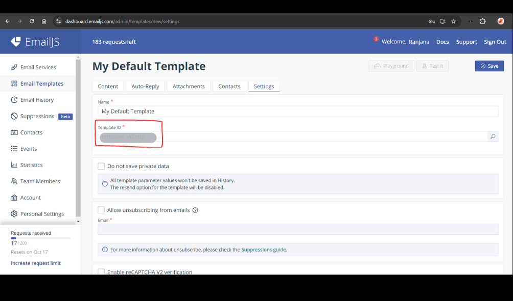
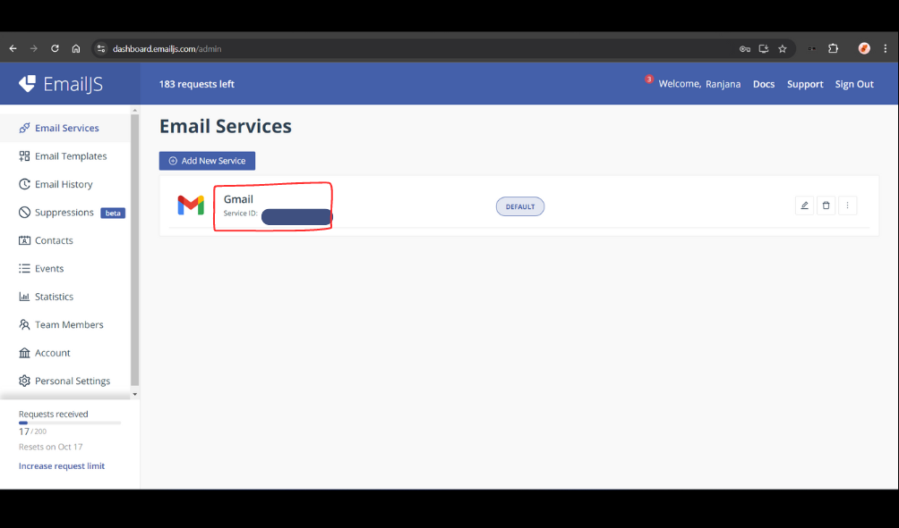

# Portfolio Website

This is a responsive portfolio website built using **React.js**, **Tailwind CSS**, **Material UI**, and **Bootstrap**.
It showcases my work, skills, and contact details, with animations and integrated email functionality for a seamless user experience.

**Demo Link**- https://shashiyadav.vercel.app/

## Features

- **Responsive Design**: Fully optimized for different screen sizes and devices.
- **Animations**: Smooth animations enhance the user interface and improve the overall user experience.
- **Email Functionality**: Users can contact me directly through the site using **EmailJS**.
- **Modern UI**: Tailored with Tailwind CSS, Material UI, and Bootstrap for a clean and professional design.

## Technologies Used

- **React.js**: Frontend framework for building the interactive user interface.
- **Tailwind CSS**: Utility-first CSS framework for fast and responsive design.
- **Material UI**: Provides a comprehensive set of UI components.
- **Bootstrap**: Ensures compatibility across browsers and additional responsive layout capabilities.

## Installation and Setup

1. Clone the repository: git clone https://github.com/yourusername/portfolio.git

2. Navigate to the project folder: cd portfolio

3. Install the dependencies: npm install

4. Set up **EmailJS** for email functionality:

   - Go to [EmailJS](https://www.emailjs.com/) and create an account.
   - Generate an **EmailJS Service ID**, **Template ID**, and **Public Key**.
   - Add these as environment variables in your project by creating .env file :
     **Template ID:**
     
     **Service ID:**
     
     **Public Key:** from your account

     REACT_APP_EMAILJS_SERVICE_ID=your-service-id
     REACT_APP_EMAILJS_TEMPLATE_ID=your-template-id
     REACT_APP_EMAILJS_PUBLIC_KEY=your-public-key

   - Create a `.env` file in the root of your project and paste the above variables.

5. For further help with **EmailJS** setup, you can watch this video: [EmailJS Setup Guide](https://youtu.be/wWiTouBHibs?si=TkENN8BdpGdX30jb)

6. Start the development server: npm run start

7. Open your browser and visit:

   http://localhost:3000

## Contact

Feel free to reach out via email or through the contact form on the portfolio.
